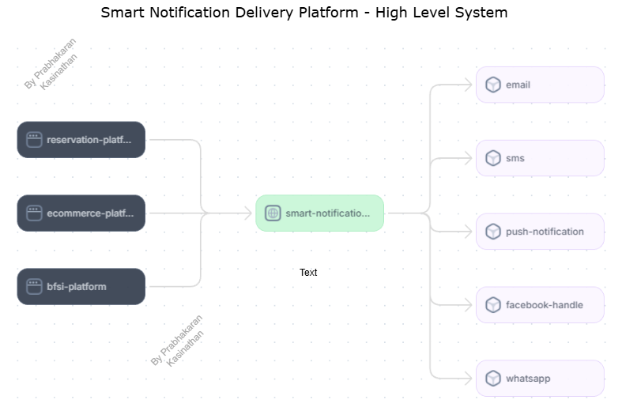
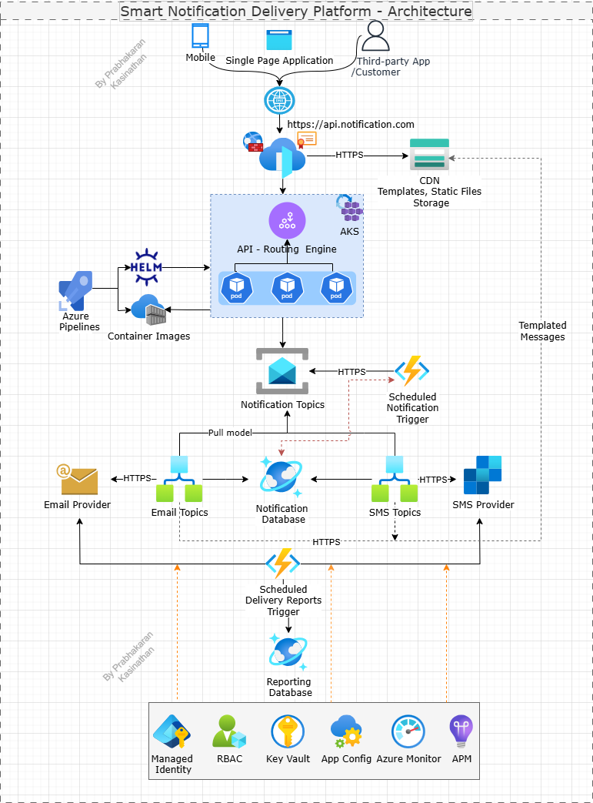

# Smart Notification System

## Notification Routing Engine API

This is a .NET 8 Web API for sending email and SMS notifications via Azure Service Bus topics. The solution is structured according to Clean Architecture principles, ensuring separation of concerns and maintainability.

---

## System Architecture

### High-Level System Diagram

The Smart Notification Delivery Platform acts as a central notification engine, integrating with various business platforms (e.g., reservation, ecommerce, BFSI) and delivering notifications through multiple channels such as email, SMS, push notifications, Facebook, and WhatsApp.

### Technical Architecture Diagram

**Key Components:**
- **API Routing Engine (AKS):** Handles incoming requests from web/mobile/third-party apps, routes them to the appropriate notification topics.
- **Azure Service Bus Topics:** Decouples notification processing and delivery.
- **Notification Database:** Stores notification metadata and delivery status.
- **Email/SMS Providers:** External services for actual message delivery.
- **Reporting Database:** Stores delivery and reporting data.
- **Scheduled Triggers:** For scheduled notifications and delivery reports.
- **Security & Monitoring:** Managed Identity, RBAC, Key Vault, App Config, Azure Monitor, and APM for secure and observable operations.

---

## Features
- Accepts POST requests to send email and SMS notifications
- Publishes messages to Azure Service Bus topics
- Request and response validation using FluentValidation
- Auditing middleware that logs HTTP request and response payloads for traceability
- Application Insights integration for monitoring and diagnostics
- Clean Architecture structure (Domain, Application, Infrastructure, API)

## Solution Structure

- **Domain**: Core business models and enums (e.g., `NotificationRequest`, `Priority`, `NotificationChannel`)
- **Application**: Business logic, contracts, validators, and DTOs (e.g., `EmailNotificationRequest`, `SmsNotificationRequest`, `IAuditLogger`)
- **Infrastructure**: Implementations for logging, audit logging, and external services (e.g., Azure Service Bus)
- **API**: Entry point, controllers, and middleware (e.g., `AuditMiddleware`)

## Getting Started

1. **Build the project:**dotnet build
2. **Run the project:**dotnet run
3. The API will be available at `http://localhost:5191` (refer the port specified in launch settings).

## Running Unit Tests

To run all unit tests, execute:

The test project uses xUnit, Moq, and FluentAssertions for comprehensive test coverage.

## Docker

### Build and Run with Docker

1. **Build the Docker image:**

2. **Run the container:**

- The Dockerfile uses multi-stage builds for efficient image size.
- Automated tests are executed during the build; the image is only produced if all tests pass.
- The runtime container runs as a non-root user for security (least privilege).

## Configuration
- Update Azure Service Bus connection string and topic name in the configuration files.

## Endpoints
- `POST /api/notifications/email` - Send an email notification
- `POST /api/notifications/sms` - Send an SMS notification

## Requirements
- .NET 8 SDK
- Azure Service Bus resource
- Docker (for containerized deployment)

---

This project uses Clean Architecture. Please refer to the source code for folder structure and details.
